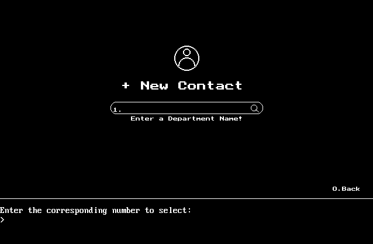

# 📇 Contact Information Management System (CIMS)

**Contact Information Management System (CIMS)** — a minimal, department-wise **contact manager** built in **C++** using the `graphics.h` library.  
This 3rd-semester academic project provides a keyboard-first visual CLI (terminal area + on-screen graphics), secure login, input validation, and full CRUD (create / read / update / delete) for contacts organized by department.

**Keywords:** contact manager, contact-management, C++, graphics.h, CLI, keyboard-navigation, CRUD, student-project

---

 

## 📑 Table of Contents
- [About](#about)
- [✨ Features](#-features)
- [🛠️ Technology Stack](#-technology-stack)
- [🚀 How the System Works](#-how-the-system-works)
- [⚡ Quick start — How to run](#-quick-start--how-to-run)
  - [Run with Turbo C++ (recommended for original graphics.h)](#run-with-turbo-c-recommended-for-original-graphicsh)
  - [Run on modern systems (recommended alternatives)](#run-on-modern-systems-recommended-alternatives)
- [📸 Screenshots](#-screenshots)
- [🏆 Learning Outcomes](#-learning-outcomes)
- [👨‍💻 Author](#-author)
- [📝 Note](# Note)

---

## About
CIMS provides a compact, offline contact-management experience focused on learning core C++ concepts: file I/O, validation, simple on-screen graphics (via `graphics.h`), and keyboard-driven UX. It is ideal for students who want an understandable codebase demonstrating GUI-like behavior without web frameworks or databases.

---

## ✨ Features
- ➕ **Full CRUD:** Add, view, edit, and delete contacts.  
- 🗂️ **Department-wise organization:** Contacts grouped by department (e.g., Account, Advertisement, Canteen, Developer, Security, Technical).  
- 🖥️ **Visual GUI + terminal area:** Minimal on-screen GUI created with `graphics.h` and a separate terminal/navigation area at the bottom.  
- ✅ **Input validation:** Prevents invalid or malformed entries at input time.  
- 🔐 **User authentication:** Login + change password functionality.  
- ⌨️ **Keyboard-first navigation:** Operate entirely with keyboard (no mouse).  
- ℹ️ **About / Help screens:** Built-in project information and usage hints.

---

## 🛠️ Technology Stack
- **Language:** C++  
- **Graphics:** `graphics.h` (Turbo C++ / WinBGIm variants)  
- **IDE / Compiler:** Turbo C++ (original) or modern IDEs with `graphics.h` compatibility (see alternatives below)  
- **Storage:** File-based (no external DB) — data persisted to local files

---

## 🚀 How the System Works  

1. **Login Authentication**  
   - The user must log in with correct credentials to access the system.  

2. **Navigation**  
   - The system uses **keyboard-based navigation**. A separate terminal area at the bottom of the screen is used to guide users while interacting with the GUI.  

3. **Managing Contacts**  
   - Users can create new contacts, view all contacts, update information, or delete records.  
   - All records are managed department-wise for better organization.  

4. **Password Management**  
   - Includes the option to **change the password** for the user account.  

5. **About Section**  
   - Provides information about the project, its purpose, and usage instructions.  

---

## ⚡ Quick start — How to run

> **NOTE:** `graphics.h` is a legacy graphics header originally designed for Turbo C++. On modern systems you will typically either run the original Turbo C++ in DOSBox or use a compatibility port (WinBGIm) in Code::Blocks / Dev-C++.

### Run with Turbo C++ (recommended for original `graphics.h`)
1. Install **Turbo C++** on a Windows machine or run it inside **DOSBox**.  
2. Place the project folder inside Turbo C++ `PROJECT` or `TC` directory as required by your Turbo setup.  
3. Open the project `.cpp` in Turbo C++ and **compile** → **run**.  
4. Use keyboard navigation shown at the bottom terminal area of the application.

> If you need help running Turbo C++ in DOSBox, search for a quick DOSBox + Turbo C++ setup guide for your OS (many tutorials show how to mount the project folder and run `tc.exe`).

### Run on modern systems (recommended alternatives)
If you want to run or extend the project on modern compilers:
- **Use WinBGIm** (a `graphics.h` compatibility library) with Code::Blocks or Dev-C++ — install WinBGIm and link the graphics library, then open and build the project.  
- **Port the UI** to an alternative library (e.g., SDL) for cross-platform graphics (if you plan to modernize).  
- **Simpler option:** compile and run the non-graphics logic (file I/O, auth, validation) as a console app while you replace graphics parts gradually.

---

## 📸 Screenshots

<figure style="text-align:center">
  
  <figcaption>Figure 1: Login Screen — user authentication</figcaption>
</figure>

<figure style="text-align:center">
  
  <figcaption>Figure 2: Alternate Login view</figcaption>
</figure>

<figure style="text-align:center">
  
  <figcaption>Figure 3: Dashboard — department counts, table view, and navigation area</figcaption>
</figure>

<figure style="text-align:center">
  
  <figcaption>Figure 4: New Record — enter department</figcaption>
</figure>

<figure style="text-align:center">
  
  <figcaption>Figure 5: New Record — enter contact details</figcaption>
</figure>

<figure style="text-align:center">
  
  <figcaption>Figure 6: Profile preview before saving (Edit / Cancel)</figcaption>
</figure>

<figure style="text-align:center">
  
  <figcaption>Figure 7: Department table — counts and records</figcaption>
</figure>

<figure style="text-align:center">
  
  <figcaption>Figure 8: Account Department table — counts and records</figcaption>
</figure>

<figure style="text-align:center">
  
  <figcaption>Figure 9: Settings — Change Password & About</figcaption>
</figure>

<figure style="text-align:center">
  
  <figcaption>Figure 10: Settings — Change Password</figcaption>
</figure>

<figure style="text-align:center">
  
  <figcaption>Figure 11: Settings — About</figcaption>
</figure>

> Tip: I hope these images will help you to navigate through the system.

---

## 🏆 Learning Outcomes
- Strengthened core **C++** programming concepts (data structures, file I/O).  
- Practiced **input validation** and secure basic authentication patterns.  
- Developed a minimal **visual UI** with `graphics.h` and a keyboard-first UX.  
- Improved debugging, code organization, and user-flow design.

---

## 👨‍💻 Author  
**Author:** Dawn Leaves  
Bachelor in Computer Engineering — 3rd Semester  
- LinkedIn: _(linkedin.com/in/dawn-leaves)_  
- Email: _(dawnleaves53@gmail.com )_

---

## 📝 Note  

This project was developed for academic learning purposes. It is a **console + graphics-based system** and may not support modern compilers without additional configuration for `graphics.h`.  

Also if you want to know the internal architecture of this system contact me. You can contact me on both email and LinkedIn.

